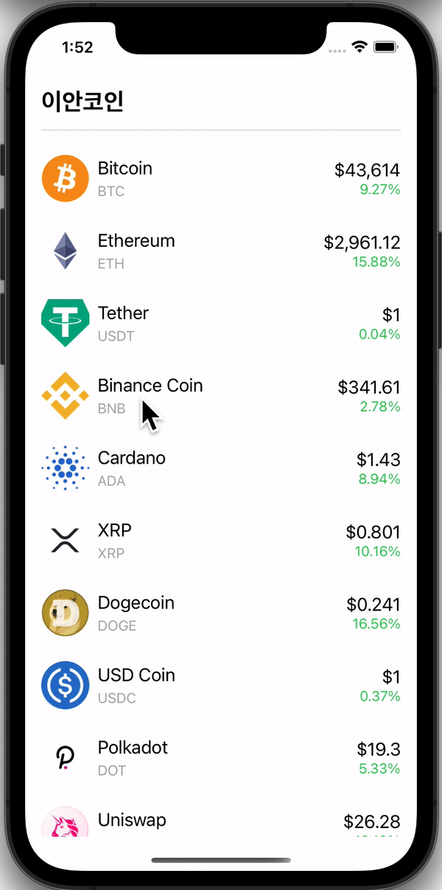

# React Native Cryptocurrency Project

> 🧑🏻‍💻 Reference Site
- React native bottom sheet  
https://github.com/gorhom/react-native-bottom-sheet

- React native animated charts  
https://github.com/rainbow-me/react-native-animated-charts

- Coingecho API (GET /coins/markets)  
https://www.coingecko.com/en/api/documentation 

#

> ⌨️ Reference keys
- expo start: start
- expo r -c: restart, clear cash
- rnfe: reactNAtiveFunctionalExportComponent
